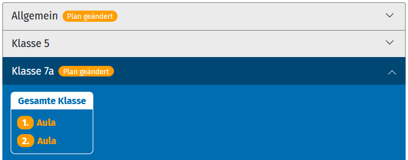
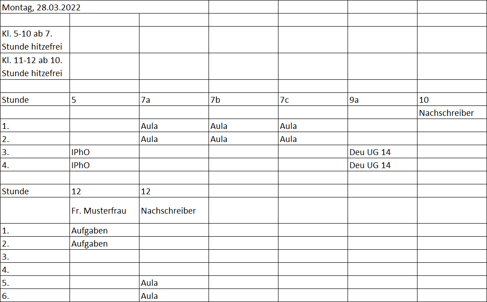

# Schedule

Test
Vertretungsplan auf https://www.gauss-gymnasium.de/plan/.

## Einrichtung


1. Git-Repo klonen (z.B. in einen Ordner namens `plan`).
1. `settings.php.example` kopieren und Kopie in `settings.php` umbenennen.
1. Fehlende Einstellungen (`/* Change Me */`) in `settings.php` ergänzen und restliche Einstellungen entsprechend der eigenen Bedürfnisse anpassen.
1. Verzeichnis für die Plan-Dateien erstellen (Standard: `data`, in `settings.php` einstellbar).
1. Vertretungsplan-System veröffentlichen, indem der gesamte Ordner (in unserem Beispiel `plan`) auf einen Server kopiert wird.

### Nutzer einrichten

*Achtung: `settings.php` nie auf GitHub hochladen! Außerdem: Jeder mit Zugriff auf den Server kann die Zugangsdaten aller Nutzer sehen.*

Nutzer werden in der `settings.php` definiert.

## Vertretungsplan anlegen

*Admin-Rechte nötig*

1. Vertretungsplan in z.B. Excel nach dem untenstehenden Format anlegen
1. Im Menü "Plan hinzufügen" wählen. Es erscheint die Seite zum Anlegen eines neuen Plans
1. Datum des Plans einstellen
1. Plan aus z.B. Excel in den Text-Editor der Seite kopieren
1. "Speichern" drücken

### Tags

Vertretungsstunden und allgemeine Informationen können mit Tags versehen werden. Tags sind besondere Zeichenketten, die Zellen des Vertretungsplans eine bestimmte Semantik geben. Je nach Tag kann das zu einem anderen Aussehen oder Verhalten führen.

#### Zuweisung von Tags

Gewünschten Tag irgendwo in der Zelle mit der Information, die getaggt werden soll, einfügen. Der Tag wird bei der Anzeige herausgelöscht. Valide Beispiele wären: `&meinTag;Inhalt`, `Inhalt &meinTag;` oder `Inh&meinTag;lt`.

#### Verfügbare Tags

Tag     | Beschreibung                              | Beispiel
--------|-------------------------------------------|-------------
`&neu;` | Hebt eine Information als geändert hervor | `&neu; Aula`: 

### Format eines Vertretungsplans

Ein Vertretungsplan ist von oben nach unten folgendermaßen aufgebaut:

1. Eine Datumszeile: Enthält Datum in erster Zelle (beliebig formatiert)
1. (Optional) Eine oder mehrere leere Zeilen
1. (Optional) Eine oder mehrere Allgemeine-Informationen-Zeilen: Zeile mit allgemeiner Information in erster Zelle, restliche Zellen leer
1. Die Element-Arten aus 2 und 3 können beliebig oft wiederholt werden
1. (Optional) Ein Plan-Block:
    1. Eine Zeile Block-Beginn: In erster Zelle "Stunde", gefolgt von einer beliebigen Anzahl von Zellen mit Klassenstufen, z.B. "5" und "7d" (werden im Plan als ausklappbare Abschnitte mit dem Präfix "Klasse" angezeigt, z.B. "Klasse 5" und "Klasse 7d")
    1. Eine Gruppen-Zeile: Erste Zelle leer, die restlichen können die darüber befindliche Klassenstufe einschränken (z.B. auf bestimmte Lehrkraft). Wenn Zelle leer, wird das im Plan als "Gesamte Klasse" dargestellt
    1. Eine oder mehrere Stunden-Zeilen: Erste Zelle `n` Schulstunden schrittweise aufsteigend ("1." bis "n."), restliche Zellen jeweilige Vertretungsinformation, wenn vorhanden
    4. Der Plan-Block endet, sobald die erste Zelle einer Zeile nicht mehr die nachfolgende Schulstunde beinhaltet
1. Die Elementarten 2-5 können beliebig oft wiederholt werden

Beispiel für einen validen Stundenplan:



## JSON API

Schedule verfügt über eine einfache JSON API. Sie kann entweder alle verfügbaren Vertretungspläne oder den Plan für ein konkretes Datum zurückgeben.
Die Anfrage geschieht durch einen POST-Request an `[URL-Vertretungsplan]/api/json.php` mit folgenden Request-Einstellungen.

```
POST-Request

Request-Header
Content-type: application/x-www-form-urlencoded

Request-Body
key=<API key>&date=<YYYY-MM-DD>
```

### Parameter

Parameter | Beschreibung | Wert
----------|--------------|-----
`key` | Authentifizierungs-Key für API | Erforderlich. Typ: `string`. Definiert in `settings.php`
`date` | Datum des gewünschten Vertretungsplans. Falls nicht angegeben, werden alle verfügbaren Pläne zurückgegeben | Optional. Format muss `YYYY-MM-DD` entsprechen

### Antworten

HTTP-Status-Code | Antwortinhalt | Beschreibung | Lösungsansatz
-----------------|---------------|--------------|----------------
`200` | Angefragte Pläne als JSON | Normalzustand | -
`400` | Fehlerbeschreibung | Das angefragte Datum ist ungültig | Sicherstellen, dass Datum im Format `YYYY-MM-DD` vorliegt
`401` | Fehlerbeschreibung | Authorisierung fehlgeschlagen. Entweder wurde keiner oder ein falscher API-Key mit der Anfrage verschickt | Mitgeschickten API-Key überprüfen
`404` | Fehlerbeschreibung | Für dieses Datum existiert kein Plan | -
